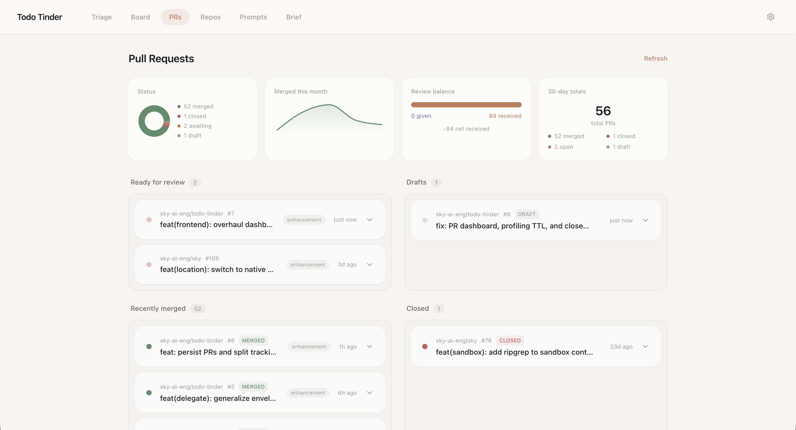
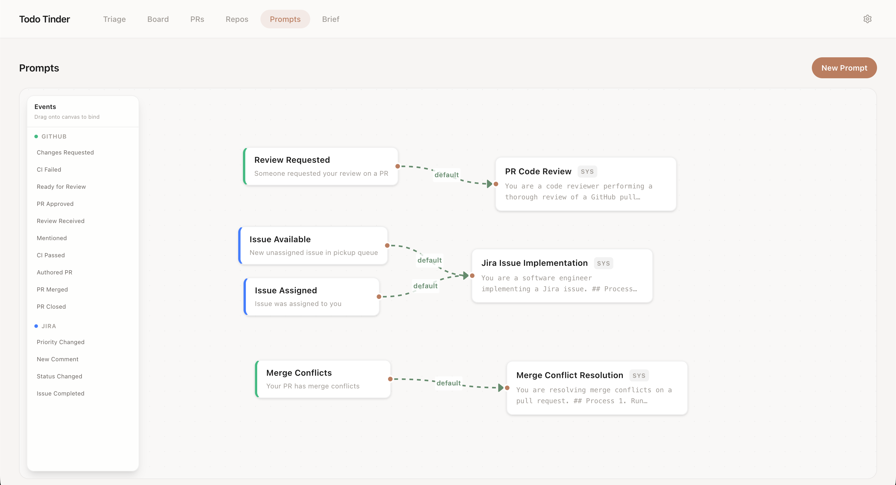

# Todo Triage

Engineering backlog triaged by AI, delegated to agents.

Todo Triage pulls in everything that needs your attention across GitHub and Jira, scores it with AI, and lets you blast through it. Swipe right to claim, swipe up to hand it to a Claude Code agent, swipe left to make it go away. The things you delegate get done how you want them done using custom prompts you write or import from Claude Code skills. PR reviews, Jira implementations, and merge conflict resolution are all handled automatically in isolated worktrees, streaming results back in real time.

It runs as a single Go binary on your machine. No hosted service, no team rollout, no DevOps. Credentials live in the OS keychain, and the only things that leave your machine are API calls to GitHub, Jira, and Claude.



## What it does

**Triage queue** — A Tinder-style card stack of everything that needs you. AI scores and ranks items so the most urgent stuff surfaces first. Swipe left (dismiss), right (claim), up (delegate to agent), down (snooze).

**Board** — Three-column kanban (You / Agent / Done) with a collapsible, searchable queue sidebar. Drag tasks between columns. Drag from You to Agent to delegate something you already claimed. The Agent column is attention-weighted: tasks needing your review float to the top, running tasks sink to the bottom.

**Agent delegation** — When you delegate a task, Todo Triage spins up a headless Claude Code instance in an isolated git worktree. The agent works autonomously — reviewing PRs, implementing Jira tickets, resolving merge conflicts, or anything else you can dream up — and streams its activity back to the board in real time. When it's done, you review and approve.

**Prompt routing** — A visual graph editor maps event types to delegation prompts. "Review requested" routes to your PR review prompt, "Jira assigned" routes to your implementation prompt. Drag event types onto prompt nodes to wire them up.



**PR dashboard** — Status donut, merge timeline, review balance, and 30-day totals. All your open, merged, and closed PRs in one place. Drag between "Ready for review" and "Drafts" to convert, all while keeping an eye on build status and merge conflicts.

**Repo profiling** — AI-generated profiles of your configured repos (from README, CLAUDE.md, AGENTS.md) so the scorer and delegation agents understand context without you having to explain it.

## Quick start

```bash
git clone https://github.com/sky-ai-eng/todo-triage.git
cd todo-triage

# Build
cd frontend && npm install && npm run build && cd ..
go build -o ./todotriage .

# Run
./todotriage
```

Requires Go 1.23+ (update local `go.mod`), Node.js 20+, and the [Claude Code CLI](https://docs.anthropic.com/en/docs/claude-code). On first launch you'll be guided through connecting GitHub and/or Jira.

See [docs/usage.md](docs/usage.md) for CLI flags, configuration reference, and polling details.

## License

[Business Source License 1.1](LICENSE) — free for internal use, converts to Apache 2.0 on 2030-03-31. See [CONTRIBUTING.md](CONTRIBUTING.md) for contribution terms.
