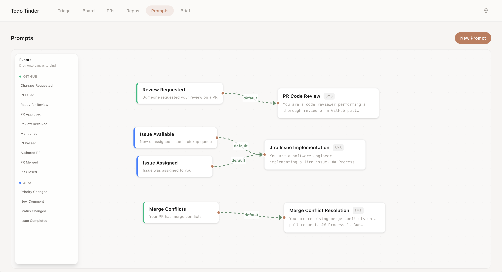
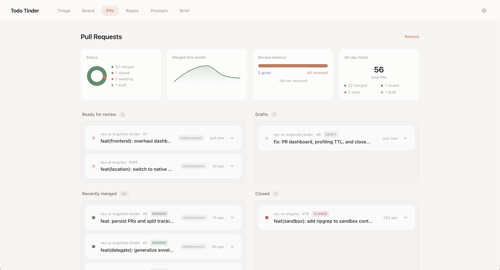

# Triage Factory

<p align="center">
  
</p>

<p align="center">An AI-powered software factory where humans decide what gets automated and can take over at any time.</p>

<p align="center">
  <a href="https://github.com/sky-ai-eng/triage-factory/releases">
    
  </a>
  <a href="https://github.com/sky-ai-eng/triage-factory/actions/workflows/test.yml">
    
  </a>
  <a href="https://github.com/sky-ai-eng/triage-factory/actions/workflows/lint.yml">
    
  </a>
</p>

Triage Factory tracks everything that needs your attention across GitHub and Jira, scores it with AI, and routes it through an automation engine visualized as a factory floor. In Triage view, swipe to claim, dismiss, snooze, or delegate tasks to Claude. You decide exactly what gets automated, and you can take over any agent's run when needed. The things you delegate get done how you want them done using prompts you write or skills imported from Claude Code. PR reviews, Jira implementations, CI failures, and merge conflict resolution are all handled automatically in isolated worktrees, streaming results to a centralized dashboard in real time.

It runs as a single Go binary on your machine. No hosted service, no team rollout, no DevOps. Credentials live in the OS keychain — or, when no keychain is reachable (a container, a headless server), an encrypted file on disk — and the only things that leave your machine are API calls to GitHub, Jira, and Claude.

## What it does

**Factory** — A live factory-floor view of your automation pipeline. Event stations show where work is in flight, how much throughput each stage is handling, and which delegated runs need attention. Zoom in and out to see more detail and take control of individual stations and runs.

**Triage queue** — A Tinder-style card stack of everything that needs you. AI scores and ranks items so the most urgent stuff surfaces first. Swipe left (dismiss), right (claim), up (delegate to agent), down (snooze).

**Board** — Three-column kanban (You / Agent / Done) with a collapsible, searchable queue sidebar. Drag tasks between columns. Drag from You to Agent to delegate something you already claimed. The Agent column is attention-weighted: tasks needing your review float to the top, running tasks sink to the bottom.

**Agent delegation** — When you delegate a task, Triage Factory spins up a headless Claude Code instance in an isolated git worktree. The agent works autonomously — reviewing PRs, implementing Jira tickets, resolving merge conflicts, or anything else you can dream up — and streams its activity back to the board in real time. When it's done, you review and approve.

**Prompt routing** — A visual graph editor maps event types to delegation prompts. "Review requested" routes to your PR review prompt, "Jira assigned" routes to your implementation prompt. Drag event types onto prompt nodes to wire them up.

<p align="center">
  
</p>

> Events are **per-action signals** — one event per check completion, one per review submission, one per push. Routing dedups those into one active card per `(entity_id, event_type, dedup_key)` so repeated churn bumps the same work item instead of spawning duplicates. For the current tracked event taxonomy, see [docs/tracked-events.md](docs/tracked-events.md).

**PR dashboard** — Status donut, merge timeline, review balance, and 30-day totals. All your open, merged, and closed PRs in one place. Drag between "Ready for review" and "Drafts" to convert, all while keeping an eye on build status and merge conflicts.

<p align="center">
  
</p>

**Repo profiling** — AI-generated profiles of your configured repos (from README, CLAUDE.md, AGENTS.md) so the scorer and delegation agents understand context without you having to explain it.

## Install

### macOS/Linux — Homebrew (recommended)

```bash
brew update
brew tap sky-ai-eng/tap
brew install triagefactory
triagefactory
```

For direct downloads, building from source, prerequisites, and platform-specific notes, see [docs/INSTALLATION.md](docs/INSTALLATION.md).

Similarly, [docs/usage.md](docs/usage.md) details CLI flags, configuration reference, polling details, and delegation/takeover workflows.

## License

[Business Source License 1.1](LICENSE) — free for internal use, converts to Apache 2.0 on 2030-03-31. See [CONTRIBUTING.md](CONTRIBUTING.md) for contribution terms.

## Disclaimer

Triage Factory is provided "as is", without warranty of any kind, express or implied, including but not limited to the warranties of merchantability, fitness for a particular purpose, non-infringement, and title. In no event shall the authors or copyright holders be liable for any claim, damages, or other liability, whether in an action of contract, tort, or otherwise, arising from, out of, or in connection with the software or the use or other dealings in the software.

Triage Factory delegates work to autonomous agents that read and write to your source repositories, ticket trackers, and local filesystem. You are solely responsible for reviewing what agents do on your behalf, for the credentials you configure, and for any consequences of automated actions taken against your systems or third-party services.

**Self-hosted multi-tenant deployments.** Triage Factory can be self-hosted in multi-tenant mode (e.g., via the provided Docker Compose configuration) to serve multiple organizations from a single deployment. Multi-tenant isolation in that configuration depends on the operator's infrastructure, configuration, network topology, secrets management, and patching cadence, as well as on the correctness of the upstream software itself — which, like all software, may contain isolation, sandboxing, or row-level-security defects, known or unknown. Operators who choose to host Triage Factory for third parties do so at their own risk and are solely responsible for the security, privacy, compliance, and tenant isolation of their deployment. The authors and copyright holders make no warranty that any release is free of multi-tenant isolation defects and accept no liability for cross-tenant data exposure, sandbox escape, or any other isolation failure in self-hosted deployments.
